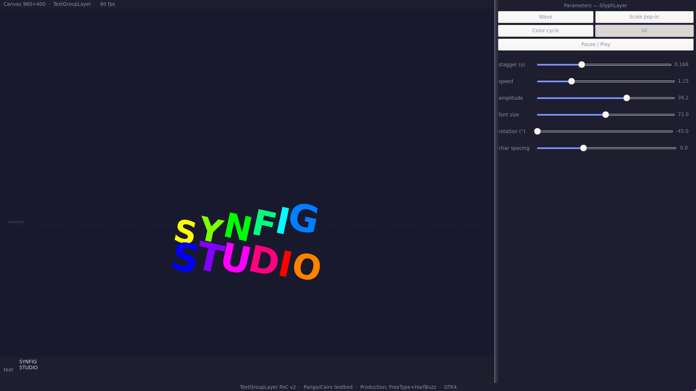
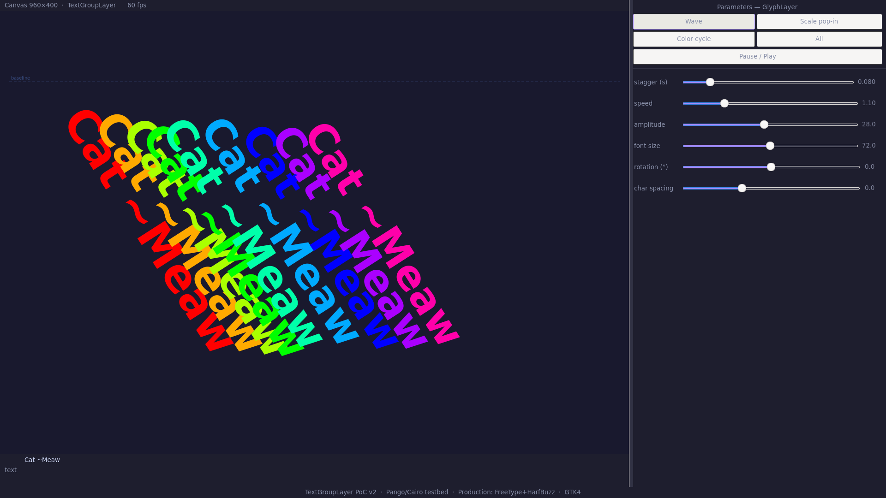

# Synfig TextGroupLayer — GSoC 2026 Proof of Concept

A working interactive prototype demonstrating per-character text animation
for Synfig Studio, built as part of a GSoC 2026 proposal.



---

## What this is

Synfig Studio's current `Layer_Freetype` merges all glyphs into a single
monolithic shape before any animation is applied. This prototype proves that
decomposing text into independently animatable per-character elements is
technically feasible — and shows exactly what the feature would feel like
to use.

Each character becomes its own animatable unit with five independently
controllable parameters: **position, rotation, scale, color, opacity**.

---

## Demo features


Per-character animation (glyph-level rendering)

Multiple animation modes (wave, bounce, color, combined)

Live text editing with instant rebuild

Multi-line text support

Staggered animation control

Adjustable spacing, amplitude, and font size

Drag-to-move interaction

Pause/play and FPS display

---

## Build

### Dependencies

**Void Linux**
```bash
sudo xbps-install gtk4-devel pango-devel cairo-devel pkg-config gcc
```

**Ubuntu / Debian**
```bash
sudo apt install libgtk-4-dev libpango1.0-dev libcairo2-dev pkg-config g++
```

**Arch Linux**
```bash
sudo pacman -S gtk4 pango cairo pkgconf gcc
```

### Compile

```bash
g++ main.cpp glyph_layer.cpp renderer.cpp -o glyph_poc \
  $(pkg-config --cflags --libs gtk4 pangocairo) \
  -std=c++17

./glyph_poc
```

---

## How it works

```
Input string
     ↓
PangoLayout + PangoLayoutIter
     ↓
Per-cluster GlyphInfo extraction
(natural_x, natural_y, width, height, PangoGlyphString)
     ↓
render_frame() — per-glyph Cairo transform loop
     ↓
cairo_translate → cairo_rotate → cairo_scale
→ pango_cairo_show_glyph_string()
```

The core extraction loop uses `pango_layout_iter_next_cluster()` — not
byte-stepping — so multi-byte UTF-8 characters and ligatures are handled
correctly as single units.

---

## Relevance to Synfig

This is a standalone prototype built using Pango/Cairo for simplicity.

In Synfig, the same idea would be implemented using:

FreeType (glyph outlines)

HarfBuzz (text shaping)

FriBiDi (bidirectional text)

The prototype mirrors this pipeline conceptually and serves as a testbed for a future TextGroupLayer implementation..

---

## Proposed Synfig class hierarchy

```
Layer_PasteCanvas        (already exists)
        ↑
Layer_StaggeredGroup     (owns stagger engine)
        ↑                          ↑
Layer_TextGroup          Layer_AnimateGroup
( deliverable)       (future scope)
        ↓
Layer_GlyphShape × N     (one per HarfBuzz cluster)
```

`Layer_StaggeredGroup` is designed so a future `AnimateGroup` — applying
staggered animation to arbitrary child layers — can subclass it with zero
changes to the TextGroup code.

---

## File structure

```
synfig-glyph-poc/
├── main.cpp          GTK4 window, controls, callbacks
├── glyph_layer.h     GlyphInfo struct, GlyphParams, extract_glyphs()
├── glyph_layer.cpp   PangoLayoutIter extraction + hue_to_rgb()
├── renderer.h        EffectMode enum, render_frame() signature
├── renderer.cpp      Per-frame Cairo render loop, all effect modes
└── README.md
```


